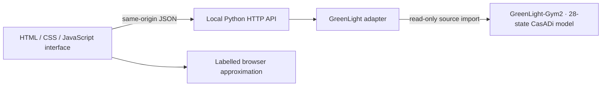

# GreenLight 2 Greenhouse Simulator

An interactive greenhouse simulation and decision-support workbench that connects a polished browser interface to the 28-state GreenLight-Gym2 scientific model. Explore climate control, crop response, actuator behavior, measured Amsterdam weather, and resource use in one local application.

[](https://github.com/benbenbeatit912002/Greenlight-simulation/actions/workflows/ci.yml)

[Overview](#overview) · [Product direction](#product-direction) · [Quick start](#quick-start) · [Model modes](#model-modes) · [Local API](#local-api) · [Model card](MODEL_CARD.md) · [Contributing](CONTRIBUTING.md)

## Overview

The simulator is designed to be useful in two settings:

- **Scientific local mode** runs the GreenLight-Gym2 CasADi/CVODES model with 28 states, six absolute controls, 15-minute steps, and measured Amsterdam weather.
- **Installation-free interaction** uses a clearly labelled browser approximation so the interface remains explorable when the scientific backend is unavailable.

The interface shows indoor and outdoor climate, crop state, control targets, actuator openings, limit warnings, trends, energy use, CO₂ use, and estimated cost. It supports both a rule-based controller and manual control of `uBoil`, `uCO2`, `uThScr`, `uVent`, `uLamp`, and `uBlScr`. The application interface can be switched between English and Traditional Chinese while the GitHub project documentation remains in English.

## Product direction

This project is an **explainable pre-deployment decision-support workbench**, not a production greenhouse controller. Run one strategy, save it as a baseline, reset, and run a candidate to the same horizon. Numeric deltas remain hidden when runs use different engines, unresolved or different model provenance, different cost assumptions, or unequal horizons. Weather context stays visible so a user can distinguish a control comparison from a broader scenario comparison.

The first comparison covers heating, supplemental lighting, CO₂, estimated cost, end-state climate alerts, and fruit dry mass. These are trade-offs rather than a single winner score, and the interface explicitly states that simulation output is not production advice.

The evidence, target user, scope boundaries, and staged roadmap are documented in [`PRODUCT_STRATEGY.md`](PRODUCT_STRATEGY.md). Engine provenance, economic assumptions, validation status, and unsupported uses are documented in [`MODEL_CARD.md`](MODEL_CARD.md).

## Quick start

### Browser approximation

This mode demonstrates the interface without importing the external GreenLight-Gym2 source tree:

```powershell
git clone https://github.com/benbenbeatit912002/Greenlight-simulation.git
Set-Location .\Greenlight-simulation
$env:PYTHONDONTWRITEBYTECODE = '1'
$env:UV_CACHE_DIR = "$PWD\.uv-cache"
uv sync --python 3.12
& '.\.venv\Scripts\python.exe' -B .\server.py --engine browser
```

Open <http://127.0.0.1:4173/>.

### Full scientific model

Install the optional open-source scientific dependencies inside this repository, then point the adapter to a read-only GreenLight-Gym2 source checkout:

```powershell
$env:PYTHONDONTWRITEBYTECODE = '1'
$env:UV_CACHE_DIR = "$PWD\.uv-cache"
$env:GREENLIGHT_GYM_PATH = 'C:\path\to\GreenLight-Gym2'
uv sync --extra greenlight --python 3.12
& '.\.venv\Scripts\python.exe' -B .\server.py --engine glgym
```

The control-panel badge should report **GreenLight 2 full model**. The adapter imports GreenLight-Gym2 read-only; it does not install into or modify that source checkout.

## Model modes

| Mode | Behavior | Intended use |
| --- | --- | --- |
| `--engine glgym` | Requires the full GreenLight-Gym2 model and stops if initialization fails. | Scientific-model validation and local research use. |
| `--engine auto` | Prefers the full model and falls back to the labelled browser approximation when unavailable. | Normal local use and presentations. |
| `--engine browser` | Serves the interface without constructing the scientific model. | UI demonstrations and lightweight review. |

The active engine is always visible in the interface and available from `GET /api/status`. Approximation output is never presented as a full scientific result.

## Architecture



- The server binds to `127.0.0.1` by default and does not enable CORS.
- API mutations use monotonic revisions to prevent stale tabs from overwriting newer state.
- The frontend stops overlapping simulation loops and safely falls back if the Python backend disappears.
- Runtime dependencies, caches, logs, and generated files stay inside this repository.

## Local API

The same-origin API is available only from the local server. CORS is disabled and the server binds to `127.0.0.1` by default:

- `GET /api/status` reports engine availability, model provenance, economic assumptions, and the current revision.
- `POST /api/reset` starts a new run for the selected weather scenario.
- `POST /api/step` advances the simulation with rule-based or manual control.

Every mutation carries a monotonically increasing `revision`. Clients send `expectedRevision` so stale tabs and duplicate requests cannot overwrite newer simulation state. The backend serializes access to the CasADi environment.

| Control | Actuator |
| --- | --- |
| `uBoil` | Boiler heating |
| `uCO2` | CO₂ injection |
| `uThScr` | Thermal screen |
| `uVent` | Roof ventilation |
| `uLamp` | Supplemental lighting |
| `uBlScr` | Blackout screen |

Example manual step:

```json
{
  "steps": 1,
  "mode": "manual",
  "controls": {
    "uBoil": 0.35,
    "uCO2": 0.15,
    "uThScr": 0.4,
    "uVent": 0.05,
    "uLamp": 0.25,
    "uBlScr": 0.0
  },
  "targets": {
    "dayTemp": 21.5,
    "nightTemp": 17.5,
    "co2": 900,
    "maxRh": 82
  },
  "expectedRevision": 1
}
```

## Validation

The deterministic browser approximation has no npm dependencies. Run its syntax and behavioral contracts with Node.js:

```powershell
node --check .\simulator-engine.js
node --check .\app.js
node --test .\tests\browser_model_contract.test.js
```

Run the default Python API and static-contract suite:

```powershell
$env:PYTHONDONTWRITEBYTECODE = '1'
& '.\.venv\Scripts\python.exe' -B -m unittest discover -s tests -p 'test_*.py' -v
```

To opt into a real CasADi reset-and-step integration check:

```powershell
$env:PYTHONDONTWRITEBYTECODE = '1'
$env:RUN_GREENLIGHT_INTEGRATION = '1'
& '.\.venv\Scripts\python.exe' -B -m unittest tests.test_greenlight_integration -v
```

Project collaboration and validation records are available from [`worklogs/index.html`](worklogs/index.html). The ready-to-copy instructions for setting up another computer are in [`SECOND_COMPUTER_PROMPT.md`](SECOND_COMPUTER_PROMPT.md).

> **Protected research mode:** GreenLight practice and GreenLight 2 source code outside this repository may be loaded read-only, but it must never be modified. Keep `.venv`, downloads, caches, logs, and outputs inside this repository; set `PYTHONDONTWRITEBYTECODE=1` and launch with Python `-B`. Thesis manuscripts, datasets, experiment outputs, and other non-source research artifacts remain out of scope.

## GitHub collaboration

- Start with [`CONTRIBUTING.md`](CONTRIBUTING.md) and the structured issue forms.
- Use [`MODEL_CARD.md`](MODEL_CARD.md) before interpreting or changing model behavior.
- Report sensitive software problems through [`SECURITY.md`](SECURITY.md), not a public issue.
- Pull requests run a free public-repository CI job containing the default Python contracts and deterministic browser-model tests. It uses no paid API, cache upload, or artifact storage.
- Every completed project task has an English HTML record in [`worklogs/index.html`](worklogs/index.html).

## License status

No open-source software license has been selected yet. Public GitHub visibility does not grant permission to copy, redistribute, or create derivative works. The repository owner must make and document the license decision before broad reuse is invited.
